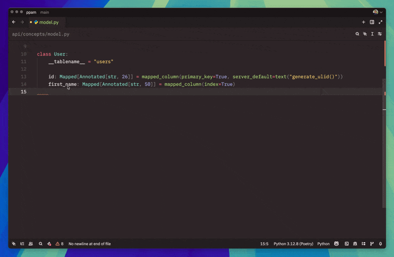

# Ollama Copilot

A proxy that allows you to use Ollama as a coding assistant similar to GitHub Copilot.



## Table of Contents

- [Features](#features)
- [Requirements](#requirements)
- [Installation](#installation)
  - [Install Go](#install-go)
  - [Install Ollama](#install-ollama)
  - [Install ollama-copilot](#install-ollama-copilot)
- [Usage](#usage)
  - [Basic Usage](#basic-usage)
  - [Command Line Options](#command-line-options)
  - [Environment Variables](#environment-variables)
- [IDE Configuration](#ide-configuration)
  - [Neovim](#neovim)
  - [VSCode](#vscode)
  - [Zed](#zed)
  - [Emacs](#emacs)
- [Troubleshooting](#troubleshooting)

## Features

- Works as a drop-in replacement for GitHub Copilot
- Compatible with multiple IDEs
- Uses local LLMs through Ollama for privacy and control
- Customizable model selection

## Requirements

- Go 1.20 or higher
- Ollama installed and running
- At least 16GB RAM (depending on the LLM model used)

## Installation

### Install Go

1. Download Go from the [official website](https://go.dev/dl/):

```bash
# For Linux (adjust version as needed)
wget https://go.dev/dl/go1.25.0.linux-amd64.tar.gz
sudo tar -C /usr/local -xzf go1.25.0.linux-amd64.tar.gz

# For macOS (using Homebrew)
brew install go
```

2. Add Go to your PATH in `~/.bashrc`, `~/.zshrc`, or equivalent:

```bash
export PATH=$PATH:/usr/local/go/bin
export GOPATH=$HOME/go
export PATH=$PATH:$GOPATH/bin

# Apply the changes
source ~/.bashrc  # or source ~/.zshrc
```

3. Verify the installation:

```bash
go version
```

### Install Ollama

Ensure [Ollama](https://ollama.com/download) is installed:

```bash
curl -fsSL https://ollama.com/install.sh | sh

# For macOS (using Homebrew)
brew install ollama
```

#### Download the required model

```bash
ollama pull qwen3-coder:30b
```

You can use other models as well, but `qwen3-coder:30b` is the default expected by ollama-copilot.

### Install ollama-copilot

```bash
go install github.com/josuemontano/ollama-copilot@latest
```

## Usage

### Basic Usage

1. Make sure Ollama is running:

```bash
ollama serve
```

2. In a separate terminal, start ollama-copilot:

```bash
ollama-copilot
```

3. Configure your IDE to use the proxy (see [IDE Configuration](#ide-configuration) below)

### Command Line Options

| Flag               | Default                                                                     | Description                              |
| ------------------ | --------------------------------------------------------------------------- | ---------------------------------------- |
| `--port`            | `:11437`                                                                    | HTTP port to listen on                   |
| `--proxy-port`      | `:11438`                                                                    | HTTP proxy port to listen on             |
| `--port-ssl`        | `:11436`                                                                    | HTTPS port to listen on                  |
| `--proxy-port-ssl`  | `:11435`                                                                    | HTTPS proxy port to listen on            |
| `--cert`            | `""`                                                                        | Certificate file path (\*.crt) for HTTPS |
| `--key`             | `""`                                                                        | Key file path (\*.key) for HTTPS         |
| `--model`           | `qwen3-coder:30b`                                                           | LLM model to use with Ollama             |
| `--num-predict`     | `200`                                                                       | Maximum number of tokens to predict      |
| `--prompt-template` | `<\|fim_prefix\|> {{.Prefix}} <\|fim_suffix\|>{{.Suffix}} <\|fim_middle\|>` | Fill-in-middle template for prompts      |
| `--verbose`         | `false`                                                                     | Enable verbose logging mode              |

Example with custom options:

```bash
ollama-copilot --model qwen2.5-coder:7b --num-predict 300 --verbose
```

### Environment Variables

You can configure the Ollama host using environment variables:

```bash
OLLAMA_HOST="http://192.168.133.7:11434" ollama-copilot
```

## IDE Configuration

### Neovim

1. Install [copilot.vim](https://github.com/github/copilot.vim)
2. Configure variables in your Neovim config:

```vim
let g:copilot_proxy = 'http://localhost:11435'
let g:copilot_proxy_strict_ssl = v:false
```

### VSCode

1. Install the [GitHub Copilot extension](https://marketplace.visualstudio.com/items?itemName=GitHub.copilot)
2. Configure settings (File > Preferences > Settings or Ctrl+,):

```json
{
  "github.copilot.advanced": {
    "debug.overrideProxyUrl": "http://localhost:11437"
  },
  "http.proxy": "http://localhost:11435",
  "http.proxyStrictSSL": false
}
```

### Zed

1. [Open settings](https://zed.dev/docs/configuring-zed) (Ctrl+,)
2. Set up edit completion proxying:

```json
{
  "features": {
    "edit_prediction_provider": "copilot"
  },
  "show_completions_on_input": true,
  "edit_predictions": {
    "copilot": {
      "proxy": "http://localhost:11435",
      "proxy_no_verify": true
    }
  }
}
```

### Emacs

(Experimental)

1. Install [copilot-emacs](https://github.com/copilot-emacs/copilot.el)
2. Configure the proxy in your Emacs config:

```elisp
(use-package copilot
  :straight (:host github :repo "copilot-emacs/copilot.el" :files ("*.el"))  ;; if you don't use "straight", install otherwise
  :ensure t
  ;; :hook (prog-mode . copilot-mode)
  :bind (
         ("C-<tab>" . copilot-accept-completion)
         )
  :config
  (setq copilot-network-proxy '(:host "127.0.0.1" :port 11434 :rejectUnauthorized :json-false))
  )
```

## Troubleshooting

- If you encounter connection issues, make sure Ollama is running
- Verify that the correct ports are accessible
- Check logs by running with the `-verbose` flag
- Ensure your Go path is correctly set up in your environment
